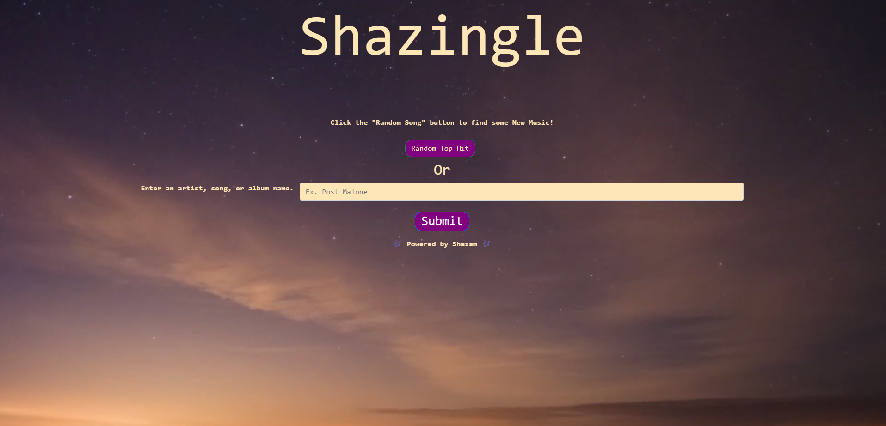
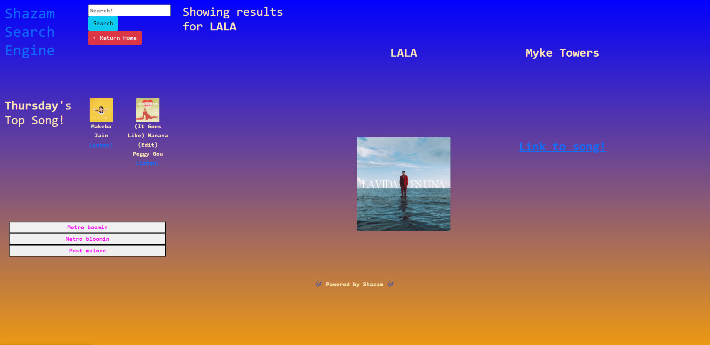

## Project 1
This is our first project of the code camp and we were assigned to use the coding skills we have learned so far to make a comprehensible webpage of our choice.
## Group Members
Lauren Bleyl, Samuel Levine, Ben Trebilcock, Nicolas Alonzo
## Acceptance Criteria
You will decide on an MVP (Minimal Viable Product) and clear it with the instructors before starting
It uses semantically correct HTML and has at least 2 html pages 
It uses Bootstrap (or other CSS Framework, or none at all), along with any custom CSS you write. The app must be responsive at a mobile and a desktop breakpoint.
jQuery recommended, not mandatory; but Javascript must be used 
Must have at least one form where the user provides some kind of information 
LocalStorage must be used for something
Must use at least one API for data 
Must use at least one new technology, library, etc...
All code must clean and well-organized, with good file structure 
No obvious bugs, no errors in dev console
Frequent code commits by all members 
Final code must be deployed to Github Pages 
Only one repo needs to be managed per group. 
## Screenshots

## Live Link
Git Pages: https://toxicmix.github.io/group-project/